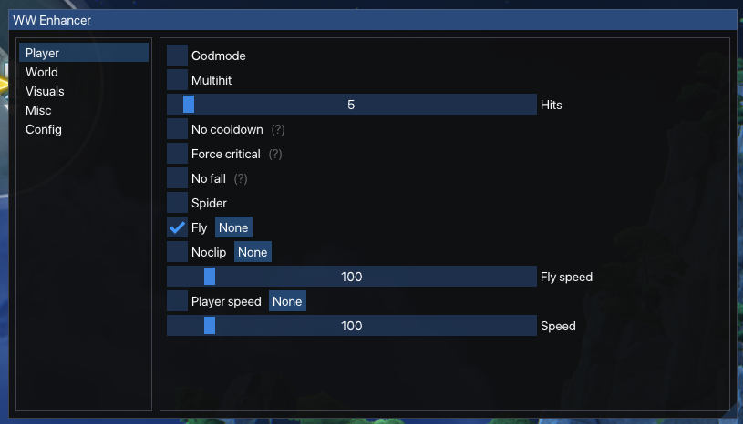

<h1 align="center">Wuthering Waves Enhancer</h1>

 

  

## Features
### Player
- Godmode
- Multihit
- No Cooldown
- Force Critical Hit
- No fall damage
- Spider (Run up any wall)
- Fly
- Noclip
- Player Speed
### World
- Dumb enemies
- World speed
- Cooking animation skip
### Visuals
- ESP
- Box
- Tracer
- Distance
- Filters
  - Monsters
  - Ascension Materials
  - Ores
  - Puzzles

### Misc
- Show FPS
- FPS Unlocker
- FOV Changer
- UID Changer
- Peeking
- Disable ACE
- Change Menu Default Key
- Style Window

### Config
- Configs
- Themes

## Usage
1. Disable all overlays
2. Inject using the injector found in the Discord
3. Press `TAB` to open the GUI

## Note
- Please report any consistent crashes to me on Discord

## Contact
- If you want to help or need help you can join the Discord [here](https://hellokittyfan48.github.io/)

#### Leave a 🌟 if you like it <3
